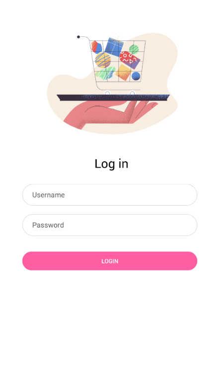
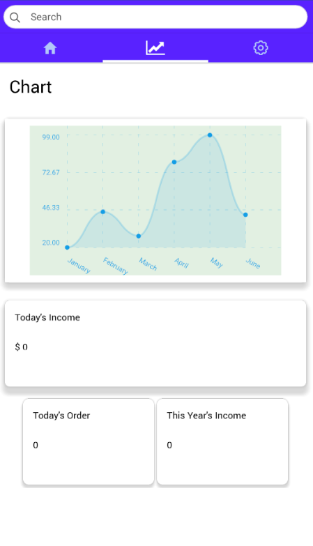
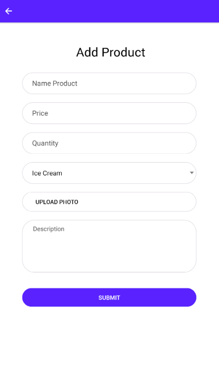
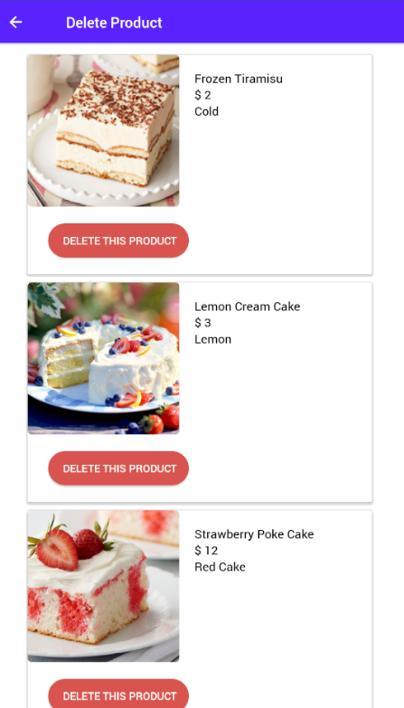
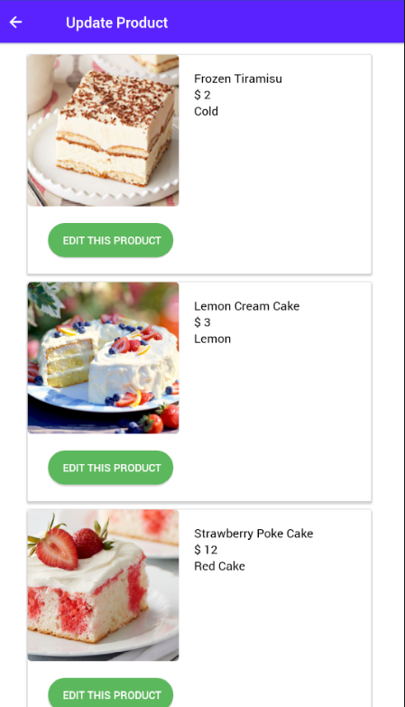
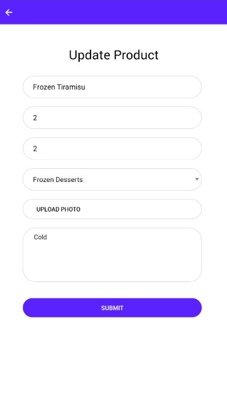

# Dessert Heaven Mobile App

Dessert heaven app is a mobile app for point of sales. The main use of this app is to take order from customer and to display our revenue.

## Getting Started

First, you need to clone this repository to your local folder. Use this command to clone this repository

```
$ git clone https://github.com/pandusudo/Dessert-heaven-mobile-rn.git
```

Make sure you have installed node js or yarn.

[click here](https://nodejs.org/en/download/ "Node js") to download node js

Then install all dependencies, by run this command in your terminal

```
npm install
```

### Run The Project

To run this project, first you need to setup your api base url in .env.example file. Rename .env.example to .env. Okay, next connect your mobile device to your laptop or you can just simply use android emulator to run this project. Alright, it's ready to run! Open terminal in the project directory, then type this in your terminal

```
react-native run-android
```

wait until the build process is complete

## Features
- Get All products
- Add product
- Reduce product
- Delete product
- Edit Product
- Login
- Register
- Chart Revenue
- Checkout History

## Screenshots









